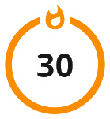

<div align="center">
  
</div>

# GitHub Readme Streak Stats <a href="https://www.patreon.com/JesKei"></a><a href="https://vercel.com"></a>

Self-hosted deployment of GitHub README Streak Stats used for Jessica Kei profile and repositories.  

Based on:  
[https://github.com/DenverCoder1/github-readme-streak-stats](https://github.com/DenverCoder1/github-readme-streak-stats)  

See original documentation:  
[UPSTREAM_README.md](./UPSTREAM_README.md)  

<br />

## Fork Features

* Added correct support for different types of names for themes.  
* Added custom theme `deep_ocean`  
  <a href="https://github.com/JessicaKei/github-readme-streak-stats"></a>  

<br />

## Public Usage

You can use this deployment to generate GitHub README streak stats for your own profile or repositories.  

Base URL:  
https://jeskei-readme-streak-stats.vercel.app/

<br />

**Examples:**  

```md
[](https://github.com/JessicaKei/github-readme-streak-stats)
```

```html
<a href="https://github.com/JessicaKei/github-readme-streak-stats">
  
</a>
```

See the original documentation for additional parameters and configuration options.  

<br />

<details>
  <summary>View a usage example (Click to show)</summary>

  <br />

  ```html
  <div align="center">
    <a href="https://github.com/JessicaKei/github-readme-streak-stats">
      
    </a>
  </div>
  ```

<div align="center">
  <a href="https://github.com/JessicaKei/github-readme-streak-stats">
    
  </a>
</div>
  
</details>

<br />

> [!IMPORTANT]
> Please use this shared public deployment responsibly.  
> This public deployment is maintained for personal use and shared provided as-is without uptime guarantees.  

<br />

> [!WARNING]
> Please avoid excessive request spam or extremely aggressive cache bypass settings.  
> Abusive usage may result in temporary or permanent blocking to protect deployment stability for other users.  
> If you need unrestricted usage, custom limits, or full control over caching behavior, you should deploy your own instance using the original project documentation.
> 
> [](https://vercel.com)

<br />

## Support

If this deployment is useful to you, you can support me on Patreon:  
[https://www.patreon.com/JesKei](https://www.patreon.com/JesKei)  
